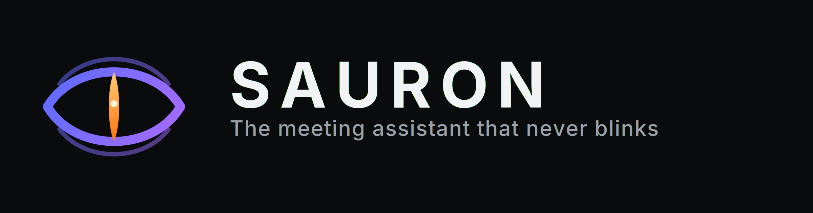

# Sauron

<p align="center">
  
</p>

A macOS 26 menu bar meeting assistant. Sauron notices when Zoom, Meet, Teams, FaceTime, Webex, or Slack huddles start, prompts you to record, captures locally, transcribes on-device, and writes a report with Ollama, LM Studio, or OpenRouter.

No bot joins the call. Audio and video stay on this Mac. Only transcript text is sent to the model you choose.

Brand assets (mark, lockups, App Icon layers, palette) live in [`brand/`](brand/README.md).

## Install

```bash
brew tap chasebank87/sauron https://github.com/chasebank87/Sauron
brew install --cask sauron
```

Upgrade with `brew update && brew upgrade --cask sauron`. See [docs/HOMEBREW.md](docs/HOMEBREW.md) for release packaging and cask maintenance. The tap is this repo (`Casks/sauron.rb`), not Homebrew’s official taps.

## Requirements

- macOS 26 Tahoe or later
- Xcode 26 (for building from source)
- [XcodeGen](https://github.com/yonaskolb/XcodeGen) (for building from source)
- Optional: [Ollama](https://ollama.com) or [LM Studio](https://lmstudio.ai) for local summaries

## Build

```bash
xcodegen generate
open Sauron.xcodeproj
```

Run the **Sauron** scheme. The app lives in the menu bar (no Dock icon).

## First launch

1. Grant Screen Recording, Microphone, and Speech Recognition when asked.
2. Open the menu bar extra → **Simulate meeting** to exercise the glass prompt without a real call.
3. In Settings → Models, point Sauron at Ollama (`http://127.0.0.1:11434`), LM Studio (`http://127.0.0.1:1234`), OpenRouter, Hermes (`http://127.0.0.1:8642`), or OpenClaw (`http://127.0.0.1:18789`).

Recordings and the SwiftData store live in `~/Library/Application Support/Sauron/`.

With **Hermes** or **OpenClaw**, Live Assist research uses the agent’s tools; Tavily settings are hidden for those backends.

## Phase 1 scope

Detection, glass record prompt, ScreenCaptureKit capture, live dual-track transcript, meeting library, post-meeting summary.

## Phase 2 scope

Speaker Profiles (renameable self on mic, remote voice clustering, report assign/edit), Live Assist HUD (insights, Tavily fact-check/research), Research settings.

## Phase 3 — Meeting memory

Local RAG index under `~/Library/Application Support/Sauron/Memory/`. Embeddings via Ollama, LM Studio, or OpenRouter (`/v1/embeddings`). Retrieved chunks feed post-meeting summaries, Live Assist “From past meetings” cards, and Dashboard Chat. Soft-fails if embeddings are unavailable.

## Phase 4 — Dashboard

Global shortcut (default ⌥⌘D) opens a multi-tab Dashboard: Analytics, Library (calendar/timeline), Open Items (cross-meeting actions/asks with manual + auto-complete), Chat, People, and Memory. Open items sync from summaries; new meetings can auto-close completed work when evidence is clear.
